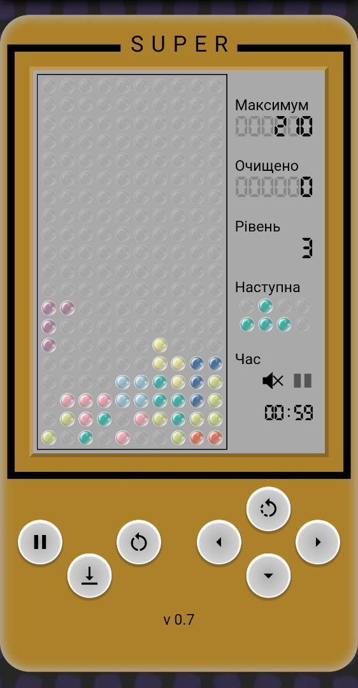

# Тетріс 0.7

## Опис

Гра розроблена на двотижневому марафоні "Пишемо гру Tetris" від [CyberBionic Systematics](https://edu.cbsystematics.com/ua).

-   🎓 Ментор курсу - Віталій Мазяр
-   🤝 Помічник ментора - Олексій Кучеренко
-   🔎 Куратор чату - Сергій Довгаль

### Особливості гри

-   🔲*7 основних фігур*
-   🎀*7 візуальних стилі*
-   🔟*10 рівнів*
-   📈*збільшення швидкості з кожним рівнем*
-   📱*2 версії гри (ПК та мобільна)*
-   🎮*керування клавіатурою, або мишею*
-   🏅*вивід інформації про отриманий досвід*
-   🌈*можливість вибору кольору приставки*
-   💬*переклад українською та англійською(частково) мовами*
-   🤘*найкращій рок від [radio ROKS](https://www.radioroks.ua/)*
-   📢*жахливі звуки пересування фігур*

## Керування

### 💻

<kbd>W</kbd> - обертання фігури

<kbd>A</kbd> - вліво

<kbd>S</kbd> - вниз

<kbd>D</kbd> - вправо

<kbd>P</kbd> - пауза

<kbd>Space</kbd> - швидке падіння фігури

<kbd>Ctrl</kbd> - інша фігура (чит)

### 📱

кнопки на екрані

## Скріншоти

 
 

[Тут можна пограти](https://fomenko-tetris-071.netlify.app)

## Технології

### Збірщики

 

### Лінтери

  

### Інструменти розробки

    

### Фронтенд

     

### Інше

   

