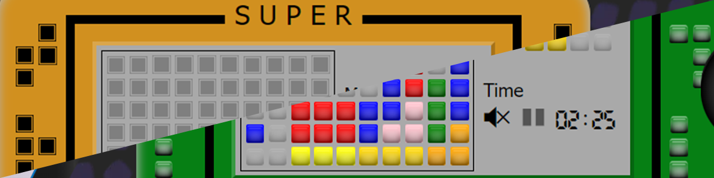
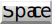
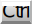
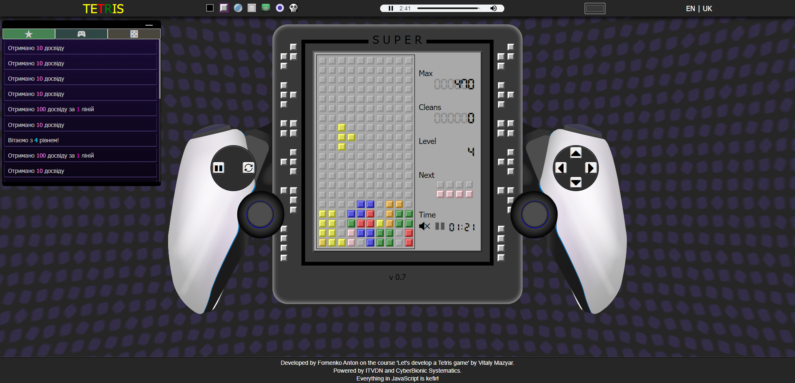
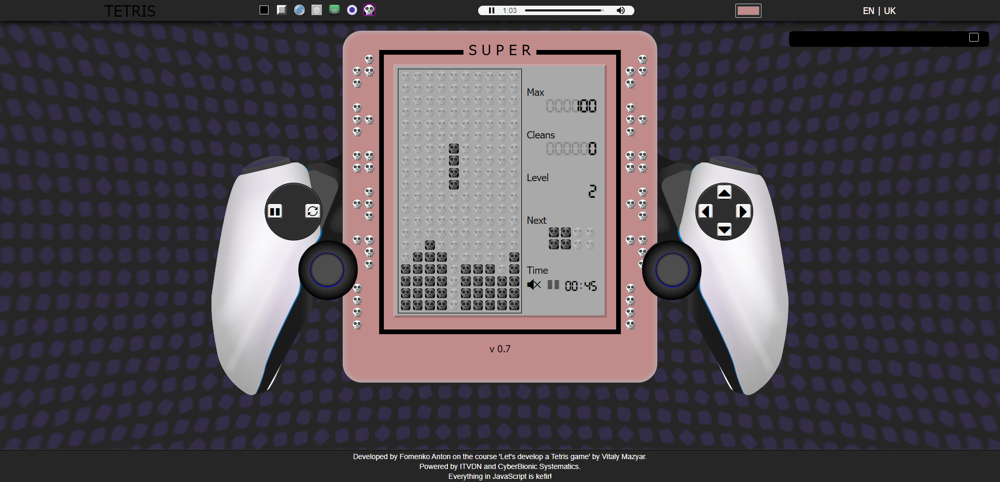
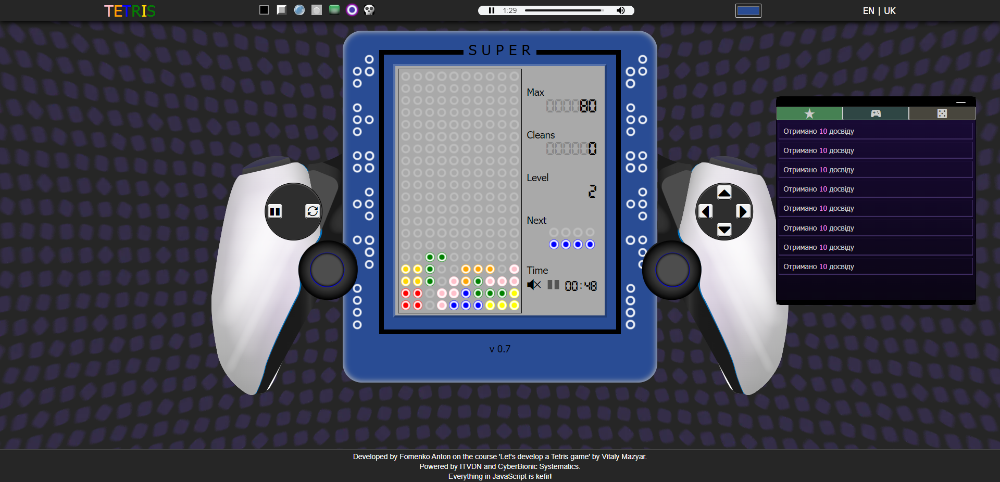
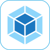
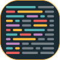
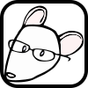

# Тетріс 0.7

## Опис

Гра розроблена на двотижневому марафоні "Пишемо гру Tetris" від [CyberBionic Systematics](https://edu.cbsystematics.com/ua).

-   🎓 Ментор курсу - Віталій Мазяр
-   🤝 Помічник ментора - Олексій Кучеренко
-   🔎 Куратор чату - Сергій Довгаль

### Особливості гри

-   🔲*7 основних фігур*
-   🎀*7 візуальних стилі*
-   🔟*10 рівнів*
-   📈*збільшення швидкості з кожним рівнем*
-   📱*2 версії гри (ПК та мобільна)*
-   🎮*керування клавіатурою, або мишею*
-   🏅*вивід інформації про отриманий досвід*
-   🌈*можливість вибору кольору приставки*
-   💬*переклад українською та англійською(частково) мовами*
-   🤘*найкращій рок від [radio ROKS](https://www.radioroks.ua/)*
-   📢*жахливі звуки пересування фігур*

## Керування

### 💻

:  - обертання фігури
:  - вліво
:  - вниз
:  - вправо
:  - пауза
:  - швидке падіння фігури
:  - інша фігура (чит)

### 📱

кнопки на екрані

## Скріншоти

[Тут можна пограти](https://fomenko-tetris-071.netlify.app)

## Технології

### Збірщики

: 
: 

### Лінтери

: 
: 
: 

### Інструменти розробки

: 
: 
: 

### Фронтенд

: 
: 
: 
: 
: 
: 

### Інше

: 
: 
: 
: 
